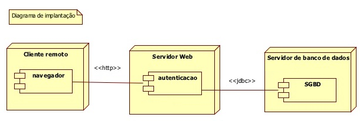
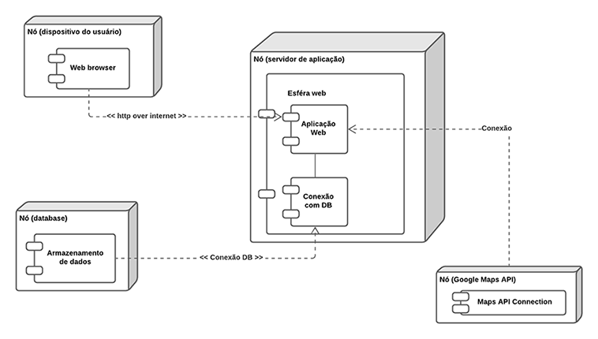

# Documento de Arquitetura de Software #

Este documento oferece uma visão geral arquitetural abrangente do sistema, usando diversas visões arquiteturais para representar diferentes aspectos do sistema. 
O objetivo deste documento é capturar e comunicar as decisões arquiteturais significativas que foram tomadas em relação ao sistema. 

## Metas e Restrições de Arquitetura ##

Existem algumas restrições de requisito e de sistema principais que têm uma relação significativa com a arquitetura. São elas:

- O sistema deverá ser acessado por meio da Intranet podendo também ficar disponível na Internet;
- A linguagem de desenvolvimento utilizada para o sistema será o C#;
- O Servidor de Aplicação `ainda não está definido`, mas a ideia seria usar a AWS;
- O Sistema Operacional que dará suporte aos serviços da aplicação deverá ser o LINUX;
- O Sistema Gerenciador de Banco de Dados escolhido para suportar a aplicação será o MySQL;

## Visão de implantação ##

## Visão de implementação ##

### Camadas ###

#### Camada de apresentação 
Será através dela que ocorrerá as requisições realizadas pelo usuário, como a procura por locais de descarte próximo, por exemplo.

#### Camada de negócio 
Possui as regras de todo o negócio. É a interface que enviará os dados para a camada de apresentação, assim como irá trabalhar com os dados da camada de dados.

#### Camada de dados
É composta pelo armazenamento dos dados gerados nas camadas acima, além de disponibilizá-los para consumo.

### Soluções utilizadas ###

- C#
- .NET Core
- VSCode para codificar
- Git 
- React (ainda a se testar)