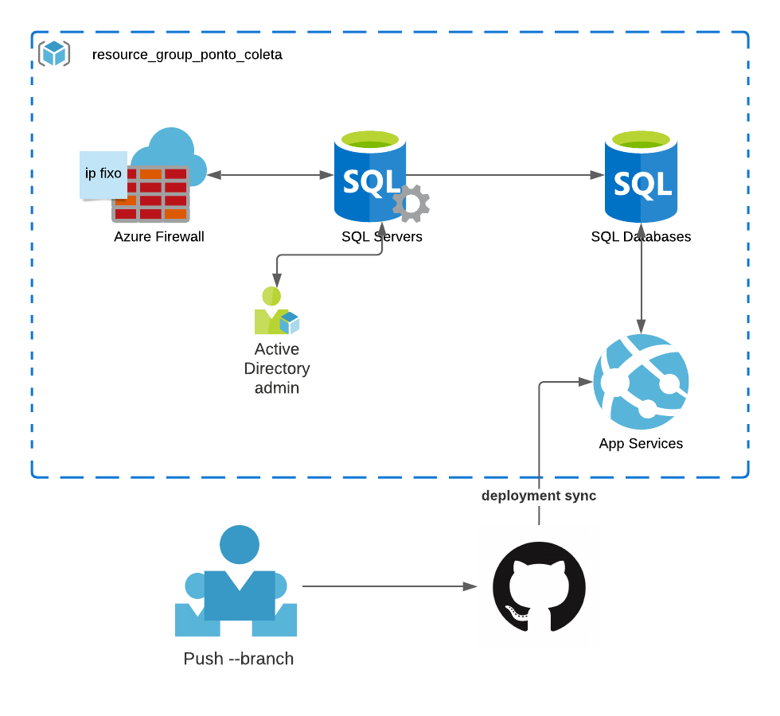

# Ponto Coleta #

## Sobre ## 

Projeto da cadeira de Desenvolvimento de Software III da Universidade do Vale do Rio dos Sinos (UNISINOS). 
Consiste na criação de um software utilizando conceitos aprendidos em cadeiras anteriores de desenvolvimento, e também aplicar novos conhecimentos se possível.

Para tal é utilizado a metodologia Scrum, com uma parte exploratória antes do desenvolvimento (criação de personas, protótipo de baixo custo, fluxo de atividades, etc).

## Tema escolhido ##

Para realizar as necessidades da cadeira, foi definido como tema a criação de uma aplicação web para divulgação de locais onde é possível realizar o descarte de alguns tipos de produtos / materiais de forma adequada.

## Sobre esse repositório ##

Consiste em uma API para realização de requests e escritas das categorias e coordenadas dos lugares. Essa API foi levantada em um App Services dentro do portal da Azure, conectado com os serviços de banco de dados e server. A intenção aqui é que essa API seja consumida por outro projeto, desacoplado, de forma a realizar a minipução das informações em JSON e disparar a requisições para a API do Google Maps, obtendo as localizações armazenadas aqui.

Abaixo é mostrado um diagrama da arquitetura da API criada.

## ##

Para maiores informações sobre a arquitetura, acessar o [Documento de arquitetura](Docs/DAS.md)
Ou, para configurar o ambiente e uso deste projeto, aconselha-se a leitura da [Wiki](https://github.com/gabcastro/Unisinos-DEVIII-PontoColeta/wiki)
